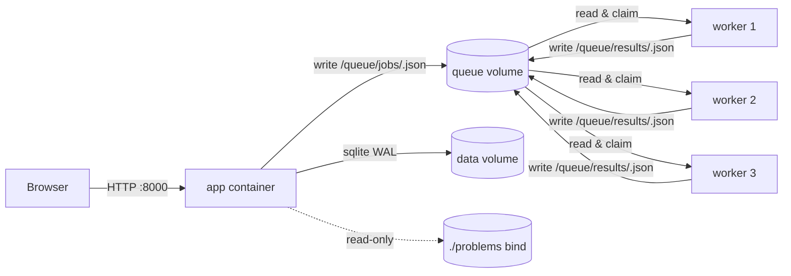

# Coding Judge - Docker variant

Same offline coding-contest judge as
[`python-process-game`](../python-process-game), but each submission is
graded inside a Docker worker container instead of a host subprocess.

If you want the simpler "run as plain Python on the Pi" version, use the
sibling directory. This one is for when you want stronger isolation
(kernel cgroups, no network, dropped capabilities) at the cost of an
extra dependency (Docker).

## Architecture



- **App container** runs FastAPI + uvicorn on `:8000`. Same UI, same
  routes, same Jinja templates, same SQLite schema as the subprocess
  variant.
- **Worker containers** are long-lived. Each one polls the shared
  `queue/` volume, atomically claims pending jobs via `os.symlink`,
  runs each test as a fresh `python3 -I -S` subprocess inside itself,
  and writes a JSON result back to the same volume.
- **No `docker.sock` is mounted into the app.** The web app and the
  workers communicate purely through atomic file drops on the shared
  volume. That means if the app gets compromised it can't escalate by
  spawning new privileged containers.

## Worker isolation

Configured in [`docker-compose.yml`](docker-compose.yml):

- `network_mode: none` - workers cannot reach anything, period.
- `read_only: true` - root filesystem is immutable.
- `tmpfs: /tmp:size=8m,exec` - the only writable spot, per-container, gone on restart.
- `user: 65534:65534` - runs as `nobody`.
- `cap_drop: [ALL]` - no Linux capabilities.
- `security_opt: no-new-privileges:true` - can't `setuid` to escalate.
- `pids_limit: 64` - blocks fork bombs.
- `mem_limit: 128m` - kernel OOM-kills the user's process if it tries to allocate more.

Inside the worker, each test runs as a *fresh* subprocess with `python3 -I -S`
(isolated mode, no site-packages, no PYTHON* env vars), so state cannot
leak between tests of the same submission.

## Files

```text
docker-container-game/
├── README.md                 # this file
├── DEPLOY.md                 # full Pi deployment runbook
├── docker-compose.yml
├── app/
│   ├── Dockerfile
│   ├── requirements.txt
│   ├── run.py                # uvicorn entry point
│   ├── app/
│   │   ├── __init__.py
│   │   ├── routes.py
│   │   ├── db.py             # SQLite, paths env-driven (JUDGE_DB_PATH)
│   │   ├── problems.py
│   │   ├── timer.py
│   │   └── judge/
│   │       ├── grader.py     # thin wrapper: builds job, calls queue_client
│   │       └── queue_client.py   # tmp+rename submit, poll for result
│   ├── templates/            # copied from python-process-game
│   └── static/               # copied from python-process-game
├── worker/
│   ├── Dockerfile
│   └── worker.py             # claim loop + per-test subprocess
└── problems/                 # bind-mounted into the app container
    ├── 01-sum-two/
    └── 02-fizzbuzz/
```

## Run it

```bash
docker compose build
echo "JUDGE_SECRET=$(openssl rand -hex 32)" > .env
docker compose up -d
```

For Pi-specific instructions (installing Docker, going air-gapped,
auto-start, day-of checklist, troubleshooting) see **[DEPLOY.md](DEPLOY.md)**.

## Why pick this over the subprocess variant?

| Concern | python-process-game | docker-container-game |
| --- | --- | --- |
| Setup steps on Pi | `pip install` | `docker compose up` |
| Sandbox layer | `setrlimit` + `killpg` on host | Container cgroups + namespaces |
| Network isolation | Host network is reachable | `network_mode: none` |
| Capability isolation | Same UID as the app server | Dropped caps, read-only fs, nobody user |
| Crash containment | Process group killed | Container killed |
| Cold-start latency | ~50 ms per test | ~50 ms per test (warm pool) |
| Fail-stop on bug | Kills the host process group | Kills only that worker container |
| Operational complexity | Single Python process | App + worker containers, named volumes |

The subprocess variant is great for the **trusted classroom** threat
model. The Docker variant is what you want if you ever expect adversarial
code (or just want kernel-enforced isolation as defence in depth).

## Environment variables

| Var | Default | Purpose |
| --- | --- | --- |
| `JUDGE_SECRET` | random per restart | Signs the session cookie. Set a stable value so sessions survive restarts. |
| `JUDGE_DB_PATH` | `/data/judge.db` | SQLite file path. |
| `JUDGE_QUEUE_DIR` | `/queue` | Shared volume for the IPC dropbox. |
| `JUDGE_PROBLEMS_DIR` | `/problems` | Where the app reads problems on startup. |
| `JUDGE_JOB_TIMEOUT_SEC` | `60` | Upper bound the app waits for a worker to return. |

All five are wired through [`docker-compose.yml`](docker-compose.yml).
